# Previous Year Questions (PYQs)

> **Unit 1** | Electrical Engineering

---

## Q&A Image References

This unit contains 27 PYQ images. Below are the embedded images for reference:

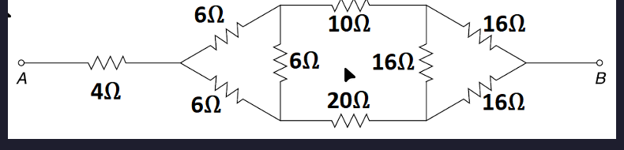
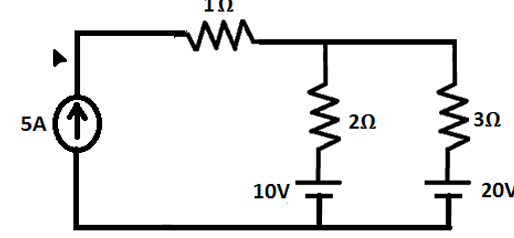
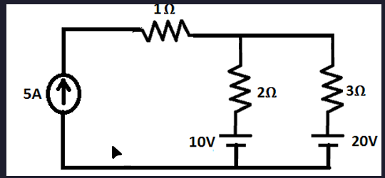
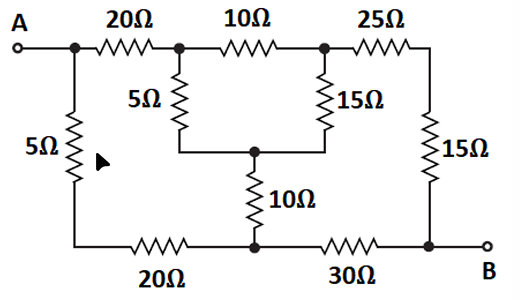
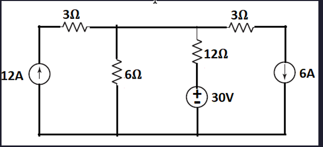
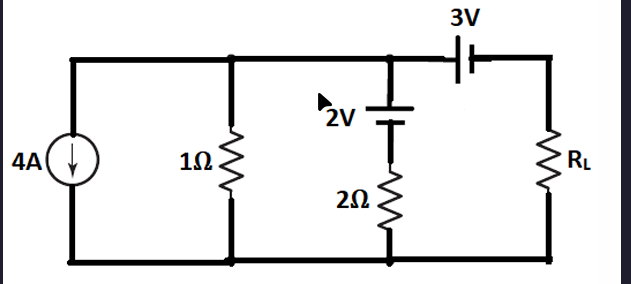
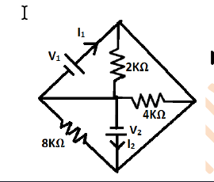
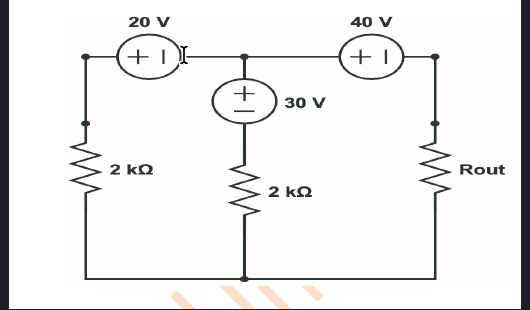
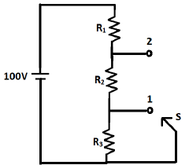
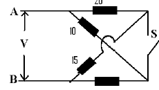
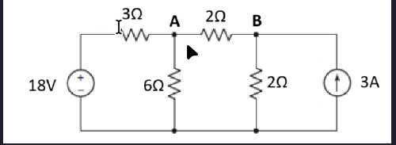
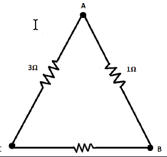
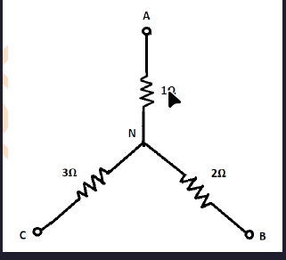
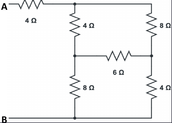
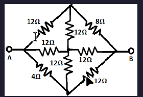
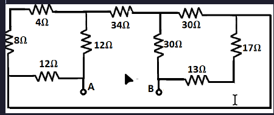
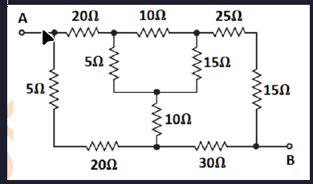
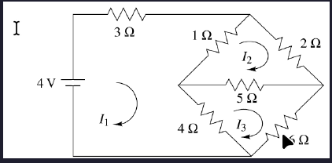
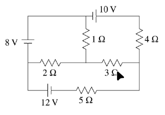
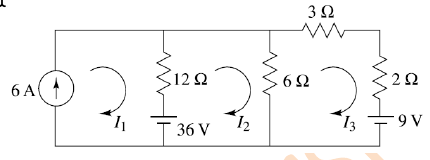
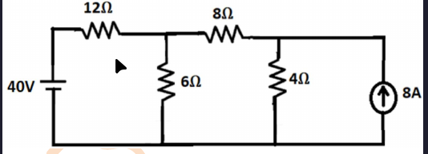
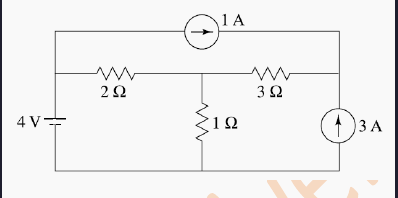
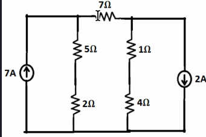
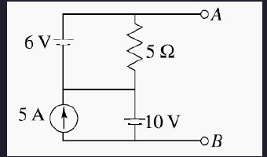
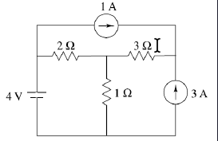
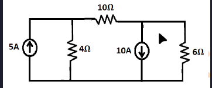
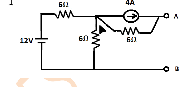

---

*Note: These images contain previous year examination questions and their solutions.*
